# Cross-Technology Network Performance Analysis: 4G, 5G, and WiFi Mesh

- Scenarios analyzed: 108
- Generated on: 2025-11-14 22:05:20

## WiFi Mesh Network Visualization

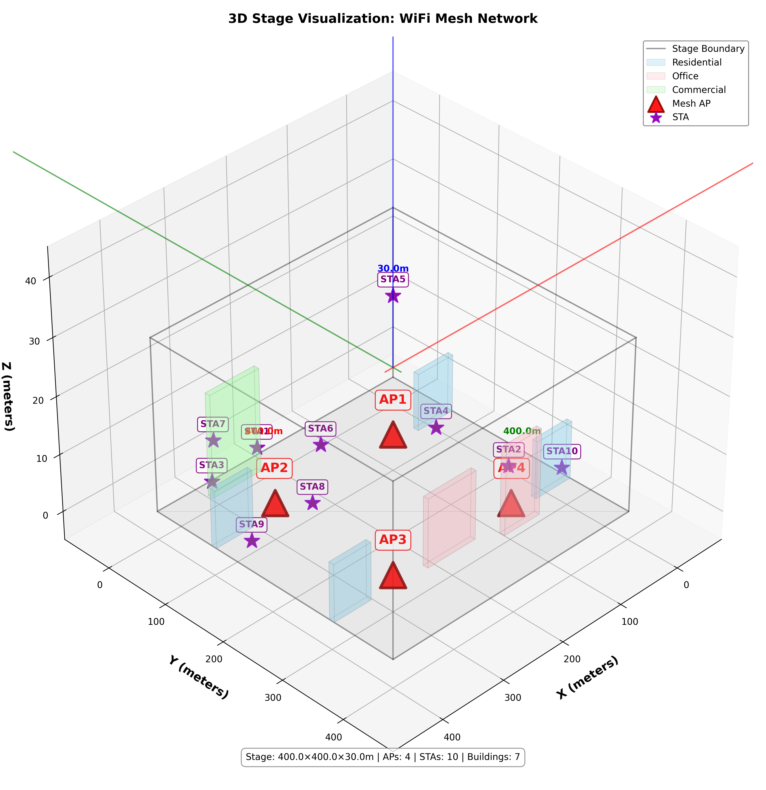

## 5G Network Visualization

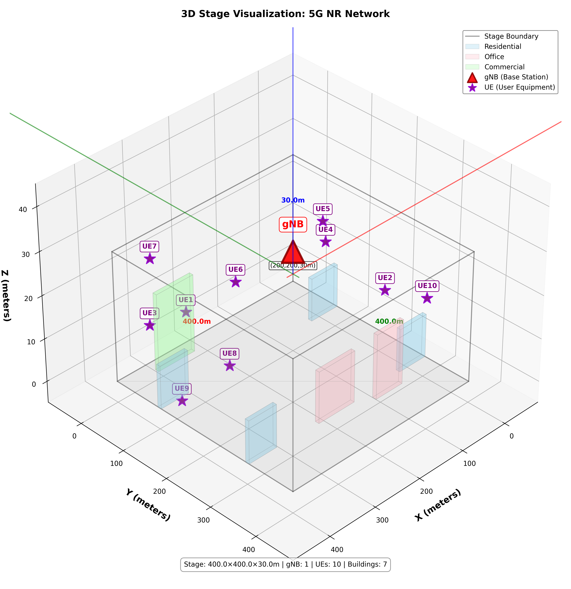

## 4G Network Visualization

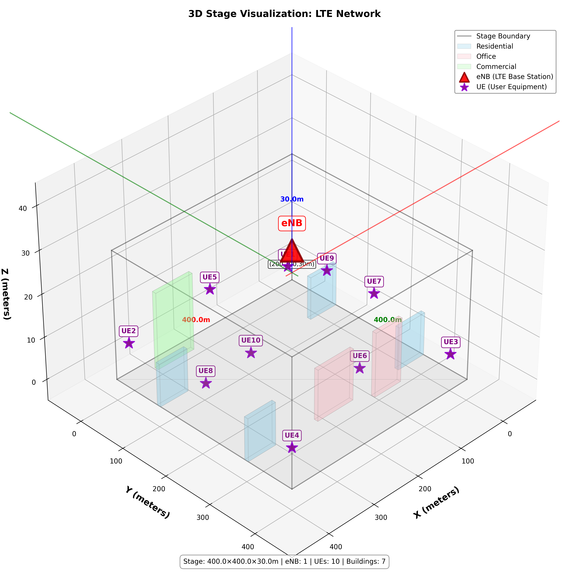

## 1. Cross-Technology Performance

- 5G achieves the highest Throughput (Mbps) (2.95).
- WIFI Mesh (2.4 GHz) achieves the highest PDR (%) (93.99).
- 5G achieves the lowest Avg Delay (ms) (11.74).

| Technology | Mean PDR (%) | Mean Throughput (Mbps) | Mean Delay (ms) | Mean Jitter (ms) |
| --- | --- | --- | --- | --- |
| WIFI Mesh (2.4 GHz) | 93.99 | 1.63 | 53.10 | 4.81 |
| WIFI Mesh (5 GHz) | 92.95 | 1.56 | 46.68 | 3.11 |
| 4G | 91.15 | 1.99 | 31.70 | 3.97 |
| 5G | 88.47 | 2.95 | 11.74 | 1.85 |

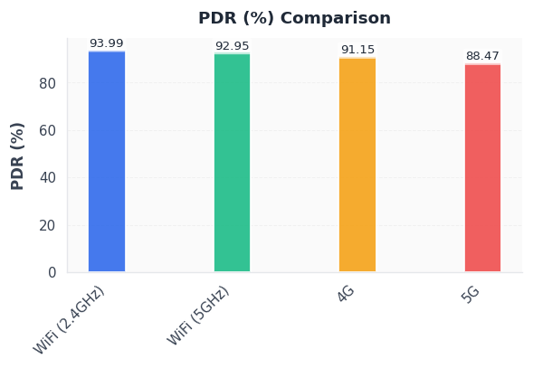

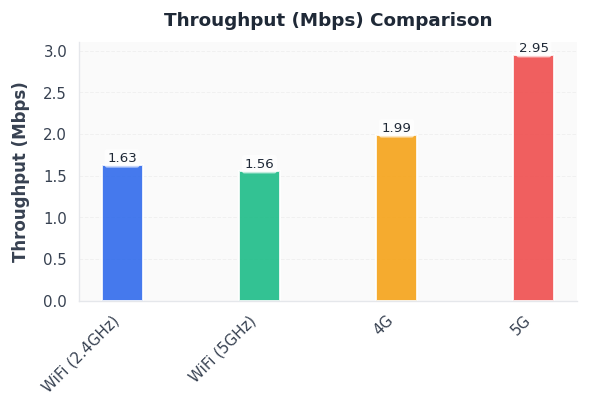

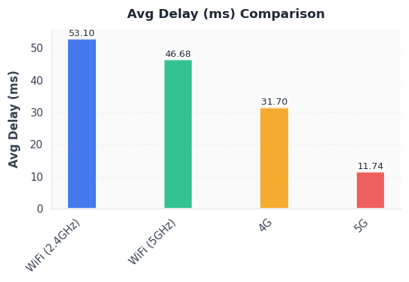

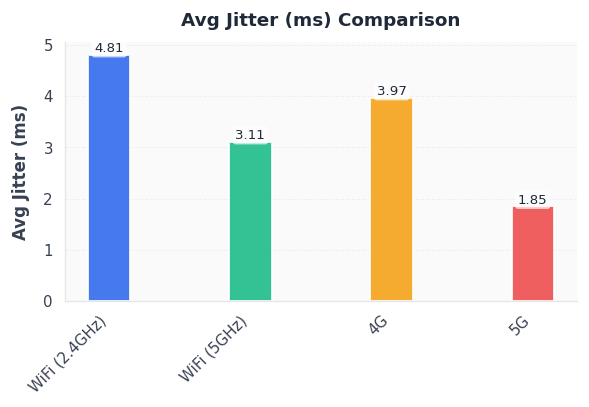

## 2. Scalability Trends

- WIFI Mesh (2.4 GHz) PDR changes by 9.04 points and delay by 44.18 ms between 5 and 15 nodes.
- WIFI Mesh (5 GHz) PDR changes by 10.79 points and delay by 55.19 ms between 5 and 15 nodes.
- 4G PDR changes by 7.52 points and delay by 27.67 ms between 5 and 15 nodes.
- 5G PDR changes by 7.17 points and delay by 1.34 ms between 5 and 15 nodes.

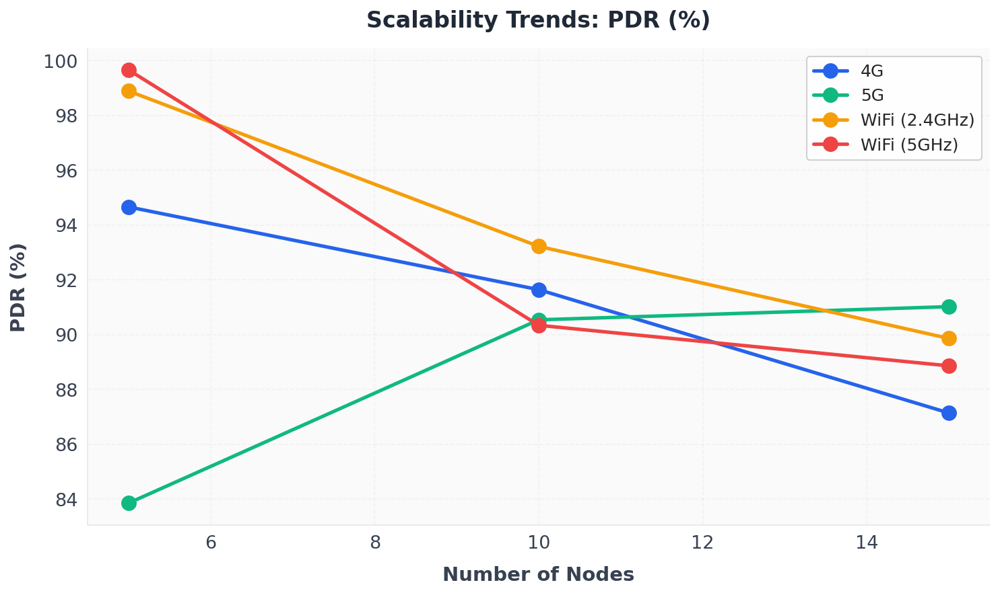

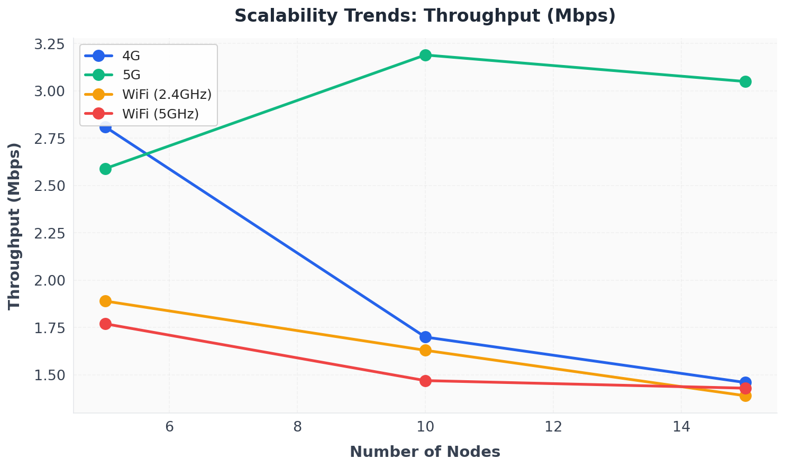

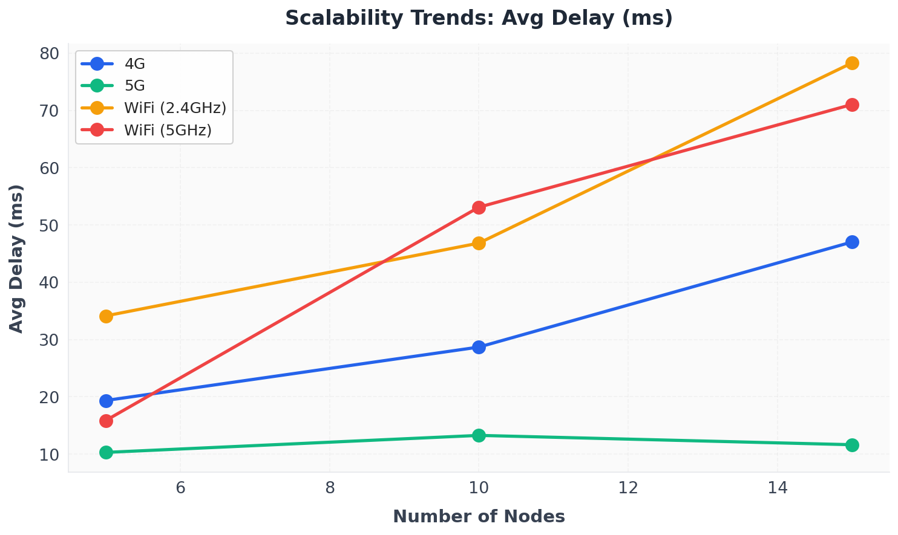

### 5 Nodes

| Technology | Mean PDR (%) | Mean Throughput (Mbps) | Mean Delay (ms) |
| --- | --- | --- | --- |
| WIFI Mesh (2.4 GHz) | 98.89 | 1.89 | 34.13 |
| WIFI Mesh (5 GHz) | 99.66 | 1.77 | 15.86 |
| 4G | 94.66 | 2.81 | 19.36 |
| 5G | 83.85 | 2.59 | 10.30 |

### 10 Nodes

| Technology | Mean PDR (%) | Mean Throughput (Mbps) | Mean Delay (ms) |
| --- | --- | --- | --- |
| WIFI Mesh (2.4 GHz) | 93.22 | 1.63 | 46.84 |
| WIFI Mesh (5 GHz) | 90.34 | 1.47 | 53.11 |
| 4G | 91.64 | 1.70 | 28.69 |
| 5G | 90.54 | 3.19 | 13.27 |

### 15 Nodes

| Technology | Mean PDR (%) | Mean Throughput (Mbps) | Mean Delay (ms) |
| --- | --- | --- | --- |
| WIFI Mesh (2.4 GHz) | 89.86 | 1.39 | 78.31 |
| WIFI Mesh (5 GHz) | 88.86 | 1.43 | 71.05 |
| 4G | 87.14 | 1.46 | 47.04 |
| 5G | 91.02 | 3.05 | 11.64 |

## 3. Statistical Summary

- Tables below summarize distribution of core KPIs across seeds, node counts, and flow scales.

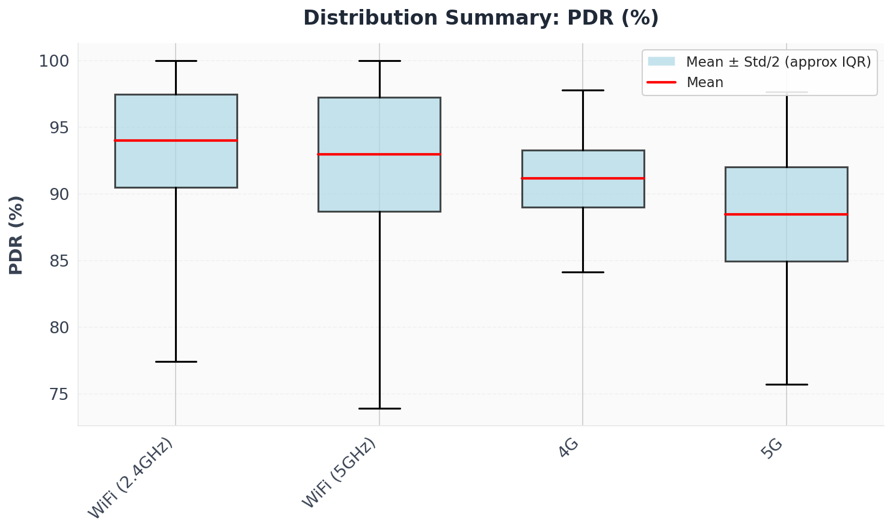

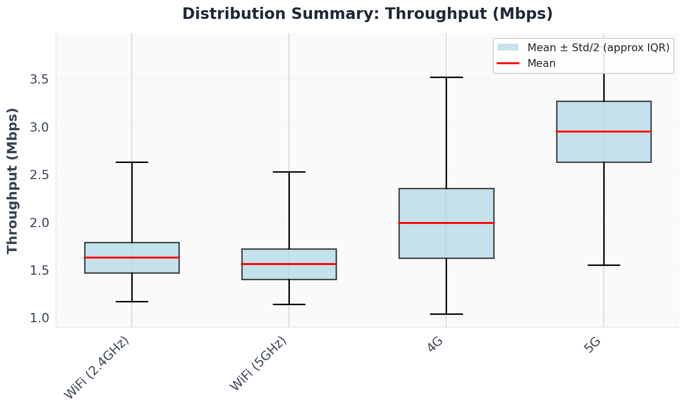

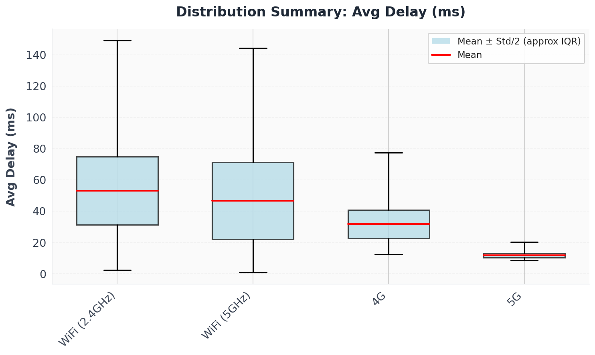

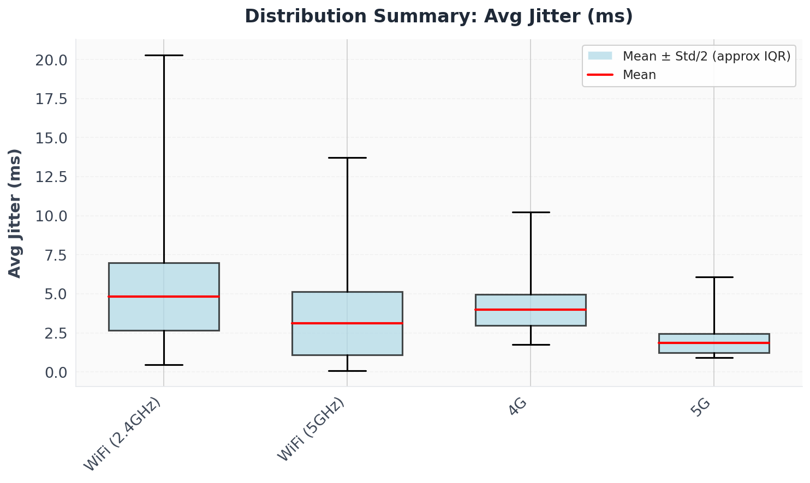

### PDR (%)

| Technology | Mean | Std Dev | Min | Max |
| --- | --- | --- | --- | --- |
| WIFI Mesh (2.4 GHz) | 93.99 | 6.99 | 77.41 | 100 |
| WIFI Mesh (5 GHz) | 92.95 | 8.56 | 73.92 | 100 |
| 4G | 91.15 | 4.26 | 84.15 | 97.77 |
| 5G | 88.47 | 7.08 | 75.72 | 97.66 |

### Throughput (Mbps)

| Technology | Mean | Std Dev | Min | Max |
| --- | --- | --- | --- | --- |
| WIFI Mesh (2.4 GHz) | 1.63 | 0.32 | 1.17 | 2.63 |
| WIFI Mesh (5 GHz) | 1.56 | 0.32 | 1.14 | 2.53 |
| 4G | 1.99 | 0.73 | 1.04 | 3.52 |
| 5G | 2.95 | 0.64 | 1.55 | 3.84 |

### Avg Delay (ms)

| Technology | Mean | Std Dev | Min | Max |
| --- | --- | --- | --- | --- |
| WIFI Mesh (2.4 GHz) | 53.10 | 43.39 | 2.31 | 149.15 |
| WIFI Mesh (5 GHz) | 46.68 | 49.11 | 0.90 | 144.11 |
| 4G | 31.70 | 18.29 | 12.32 | 77.35 |
| 5G | 11.74 | 2.96 | 8.53 | 20.21 |

### Avg Jitter (ms)

| Technology | Mean | Std Dev | Min | Max |
| --- | --- | --- | --- | --- |
| WIFI Mesh (2.4 GHz) | 4.81 | 4.33 | 0.45 | 20.29 |
| WIFI Mesh (5 GHz) | 3.11 | 4.06 | 0.09 | 13.73 |
| 4G | 3.97 | 1.96 | 1.74 | 10.25 |
| 5G | 1.85 | 1.22 | 0.91 | 6.08 |

## 4. Traffic Load Impact

- WIFI Mesh (2.4 GHz) loses 9.81 PDR points and adds 75.22 ms delay from 10KB to 1MB payload.
- WIFI Mesh (5 GHz) loses 8.92 PDR points and adds 72.08 ms delay from 10KB to 1MB payload.
- 4G gains 2.15 PDR points and adds 24.87 ms delay from 10KB to 1MB payload.
- 5G gains 5.36 PDR points and reduces 0.04 ms delay from 10KB to 1MB payload.

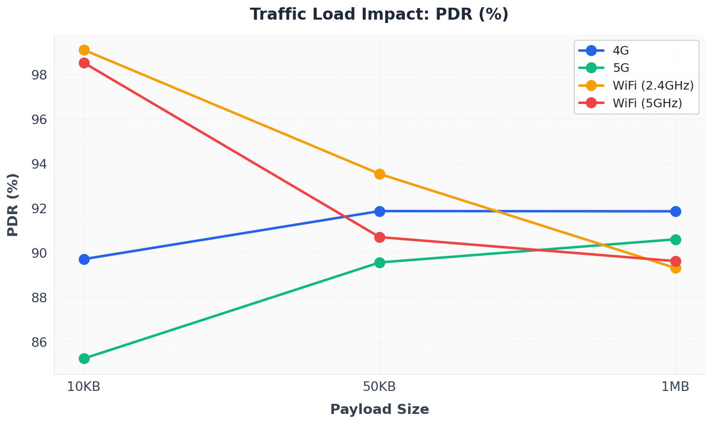

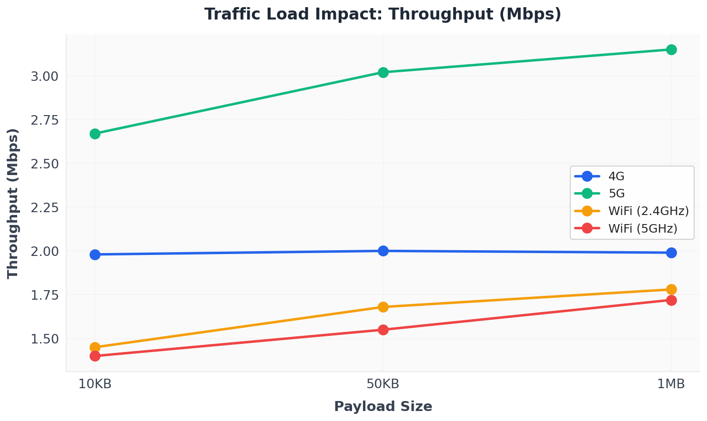

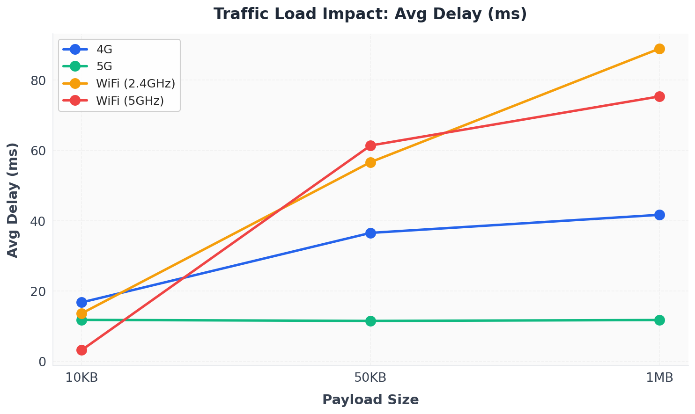

### 10KB Payload

| Technology | Mean PDR (%) | Mean Throughput (Mbps) | Mean Delay (ms) |
| --- | --- | --- | --- |
| WIFI Mesh (2.4 GHz) | 99.12 | 1.45 | 13.70 |
| WIFI Mesh (5 GHz) | 98.54 | 1.40 | 3.27 |
| 4G | 89.71 | 1.98 | 16.83 |
| 5G | 85.24 | 2.67 | 11.85 |

### 50KB Payload

| Technology | Mean PDR (%) | Mean Throughput (Mbps) | Mean Delay (ms) |
| --- | --- | --- | --- |
| WIFI Mesh (2.4 GHz) | 93.54 | 1.68 | 56.67 |
| WIFI Mesh (5 GHz) | 90.70 | 1.55 | 61.40 |
| 4G | 91.87 | 2.00 | 36.57 |
| 5G | 89.56 | 3.02 | 11.56 |

### 1MB Payload

| Technology | Mean PDR (%) | Mean Throughput (Mbps) | Mean Delay (ms) |
| --- | --- | --- | --- |
| WIFI Mesh (2.4 GHz) | 89.31 | 1.78 | 88.92 |
| WIFI Mesh (5 GHz) | 89.62 | 1.72 | 75.35 |
| 4G | 91.86 | 1.99 | 41.70 |
| 5G | 90.60 | 3.15 | 11.81 |
