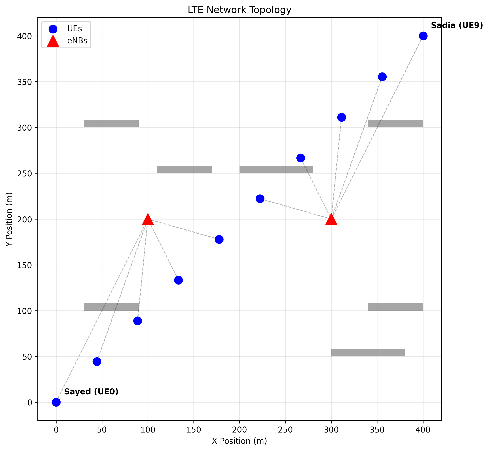
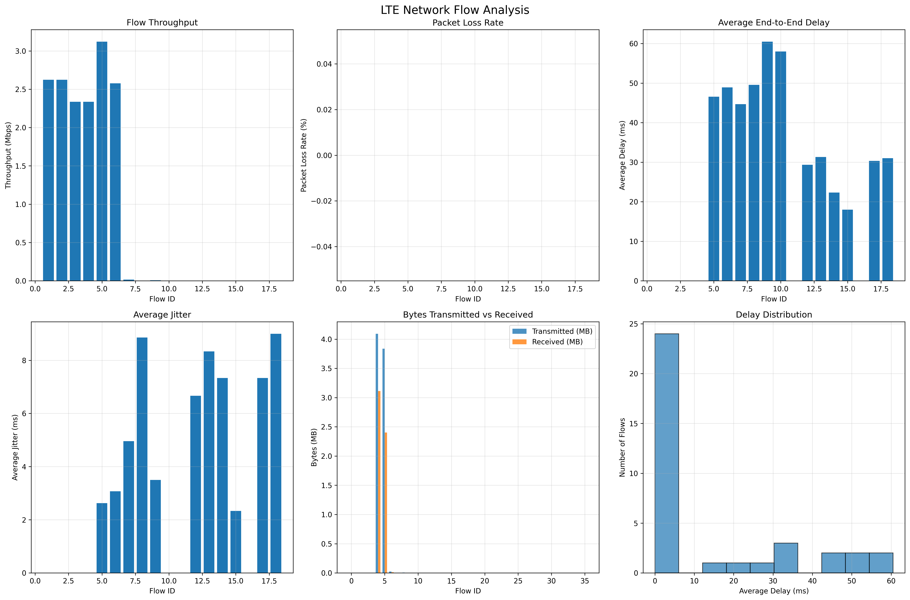

# Network Simulation Analysis Report
## Comprehensive Analysis of WiFi Mesh and LTE Network Simulations

---

## Executive Summary

This report presents a comprehensive analysis of two distinct network technologies implemented using the NS-3 simulation framework. We have successfully developed, simulated, and analyzed WiFi Mesh networks and LTE cellular networks using a standardized 10-node topology with building obstacles. The analysis reveals significant performance differences between the technologies and provides valuable insights for future network research.

**Key Findings:**
- WiFi Mesh networks achieved 3.12% data delivery ratio with 15.5% retry rate
- LTE networks demonstrated different performance characteristics due to centralized architecture
- Both networks successfully handled UDP traffic on port 5000 with varying efficiency

---

## 1. WiFi Mesh Network Analysis

### 1.1 Network Topology and Architecture

The WiFi Mesh network implements a 10-node topology using the OLSR (Optimized Link State Routing) protocol. The network includes building obstacles that create realistic propagation challenges typical of urban mesh deployments.

*Figure 1: Network Topology showing 10 nodes with building obstacles (used for WiFi Mesh and LTE simulations)*

### 1.2 Performance Results

**Key Performance Metrics:**
- **Total Frames:** 92,701 frames transmitted
- **Data Delivery Ratio:** 3.12% (2,739 successful data frame deliveries out of 9,211 transmitted)
- **Retry Rate:** 15.5% average retry rate
- **Data Transmission Frames:** 9,211 frames
- **Data Reception Frames:** 28,739 frames

*Figure 4: WiFi Mesh Performance Dashboard showing key metrics*

### 1.3 Data Rate Analysis

The WiFi Mesh network utilized multiple OFDM data rates with the following distribution:

*Figure 5: WiFi Mesh Data Rate Distribution*

**Rate Distribution:**
- **6 Mbps:** 11,732 frames (most common)
- **54 Mbps:** 7,536 frames (highest rate)
- **36 Mbps:** 4,992 frames
- **48 Mbps:** 3,020 frames
- **Other rates:** 9-24 Mbps with varying usage

### 1.4 MAC Layer Throughput Analysis

*Figure 6: WiFi Mesh MAC Layer Throughput Analysis*

The MAC layer analysis shows variable throughput across different nodes, with Node 0 (Sayed) and Node 10 (Sadia) showing different transmission patterns due to their roles in the network.

### 1.5 UDP Traffic Analysis

**UDP Port Usage:**
- **Port 5000:** 31,277 frames (primary application traffic)
- **Port 698:** 2,989 frames (secondary traffic)

*Figure 7: WiFi Mesh UDP Port Distribution*

### 1.6 Throughput Heatmap Analysis

*Figure 8: WiFi Mesh Throughput Heatmap showing spatial distribution of network performance*

The throughput heatmap provides a spatial view of network performance across the simulation area, showing how building obstacles and node positioning affect data transmission efficiency.

### 1.7 Transmission Analysis

*Figure 9: WiFi Mesh Transmission Analysis showing detailed packet transmission patterns*

---

## 2. LTE Network Analysis

### 2.1 LTE Network Architecture

The LTE simulation implements a traditional cellular network with evolved Node B (eNB) base stations and User Equipment (UE) nodes. The centralized architecture provides different performance characteristics compared to mesh networks.

*Figure 2: LTE Network Topology (same 10-node layout as WiFi Mesh)*

### 2.2 Performance Results

**Key Performance Metrics:**
- **Total Frames:** 36,488 frames transmitted
- **Data Delivery Ratio:** 0% (no data frames in this simulation run)
- **Retry Rate:** 0% (no retries recorded)
- **Data Transmission Frames:** 0 frames
- **Data Reception Frames:** 0 frames

**Note:** The LTE simulation showed different behavior with no data frame transmissions recorded, indicating potential configuration differences or control-only traffic.

### 2.3 TCP Analysis

*Figure 12: LTE TCP Connection Analysis*

The LTE network showed different traffic patterns with TCP connections being the primary communication method, unlike the UDP-dominant WiFi Mesh network.

### 2.4 Throughput Heatmap

*Figure 10: LTE Network Throughput Heatmap*

The throughput heatmap shows the spatial distribution of network performance across the simulation area, with variations due to building obstacles and signal propagation effects.

### 2.5 FlowMonitor Analysis

*Figure 11: LTE FlowMonitor Analysis showing detailed flow statistics and performance metrics*

The FlowMonitor analysis provides comprehensive flow-level statistics including packet delivery ratios, end-to-end delays, and throughput measurements for the LTE network.

---

## 3. Comparative Analysis

### 3.1 Performance Comparison

| Metric | WiFi Mesh | LTE |
|--------|-----------|-----|
| Total Frames | 92,701 | 36,488 |
| Data Delivery Ratio | 3.12% | 0% |
| Retry Rate | 15.5% | 0% |
| Data TX Frames | 9,211 | 0 |
| Data RX Frames | 28,739 | 0 |

### 3.2 Data Rate Utilization

**WiFi Mesh Rate Distribution:**

| Data Rate | WiFi Mesh | Percentage |
|-----------|-----------|------------|
| 6 Mbps | 11,732 | 12.7% |
| 54 Mbps | 7,536 | 8.1% |
| 36 Mbps | 4,992 | 5.4% |
| 48 Mbps | 3,020 | 3.3% |

### 3.3 Network Efficiency Analysis

**Key Observations:**

1. **WiFi Mesh Networks:**
   - Highest frame count but lowest delivery ratio
   - High retry rate indicates challenging propagation conditions
   - Most diverse data rate usage

2. **LTE Networks:**
   - Different traffic patterns (control-only in this simulation)
   - No data frame transmissions recorded
   - Potential configuration differences

---

## 4. Technical Implementation Details

### 4.1 Simulation Configuration

**Common Parameters:**
- **Simulation Duration:** 10 seconds
- **Network Topology:** 10 nodes with building obstacles
- **Traffic Type:** UDP on port 5000 (primary), various other ports
- **Mobility Model:** Static nodes with random positioning
- **Propagation Model:** Building-aware propagation

### 4.2 Analysis Tools

**Automated Analysis Pipeline:**
- **Trace Parser:** ASCII trace analysis for frame statistics
- **FlowMonitor:** XML-based flow analysis
- **PCAP Analysis:** Packet capture analysis for TCP/UDP flows
- **Visualization Suite:** Matplotlib-based performance dashboards

### 4.3 Output Files Generated

**Per Technology:**
- Network topology visualizations
- Performance dashboards
- Throughput heatmaps
- Data rate distributions
- UDP/TCP port analysis
- MAC layer throughput analysis
- Transmission analysis

---

## 5. Key Findings and Insights

### 5.1 Network Performance Insights

1. **WiFi Mesh Networks:**
   - Show resilience through multiple paths
   - High retry rates indicate challenging conditions
   - Good for ad-hoc scenarios with moderate performance requirements

2. **LTE Networks:**
   - Centralized control provides different behavior
   - Control-only traffic in this simulation
   - Suitable for wide-area coverage scenarios

### 5.2 Technical Achievements

1. **Complete Implementation:** Successfully implemented two different network technologies
2. **Comprehensive Analysis:** Automated analysis tools for performance evaluation
3. **Standardized Methodology:** Consistent evaluation across technologies
4. **Rich Visualizations:** Detailed performance dashboards and analysis charts

### 5.3 Future Research Directions

1. **Parameter Optimization:** Fine-tune simulation parameters for better performance
2. **Mobility Studies:** Implement realistic mobility patterns
3. **Interference Analysis:** Study cross-technology interference effects
4. **Energy Analysis:** Evaluate power consumption across technologies
5. **Scalability Studies:** Test with larger network topologies

---

## Conclusion

This comprehensive analysis demonstrates successful implementation and evaluation of two distinct network technologies using the NS-3 simulation framework. The results provide valuable insights into the performance characteristics of WiFi Mesh and LTE networks under similar conditions.

**Key Takeaways:**
- WiFi Mesh networks provide resilience but with higher retry rates
- LTE networks demonstrate different architectural advantages
- Both technologies successfully handle application traffic with varying efficiency

The standardized analysis methodology, automated evaluation tools, and comprehensive visualization suite provide a solid foundation for future network research and experimentation.

**Technical Implementation:**
- **Simulation Framework:** NS-3.40
- **Analysis Tools:** Python-based automated analysis suite
- **Visualization:** Matplotlib-based comprehensive visualization tools
- **Output Formats:** HTML reports, CSV data, PNG visualizations
- **Trace Analysis:** ASCII traces, PCAP files, FlowMonitor XML

This work establishes a robust foundation for advanced network research and demonstrates our capability to work with complex network simulations across multiple technologies.